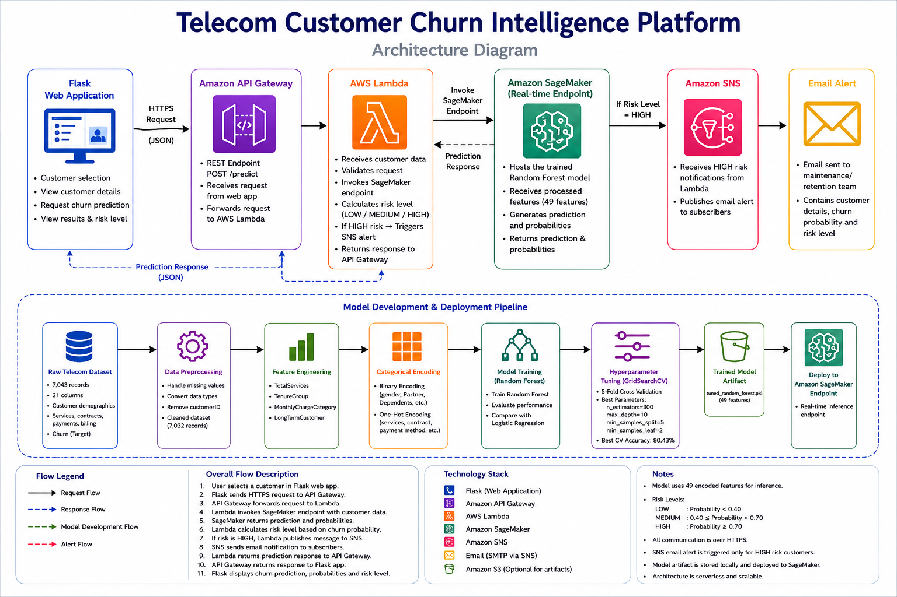
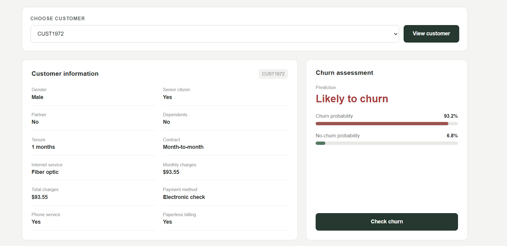
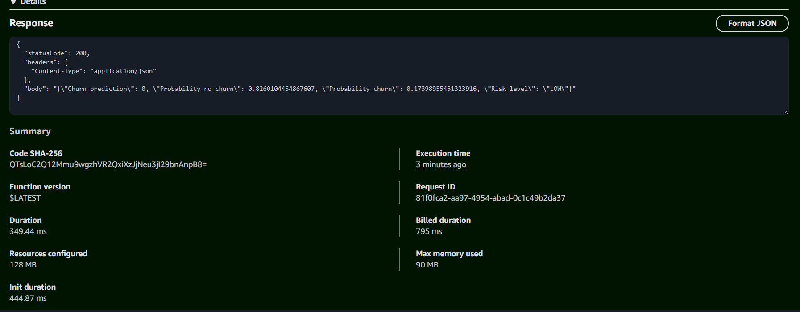
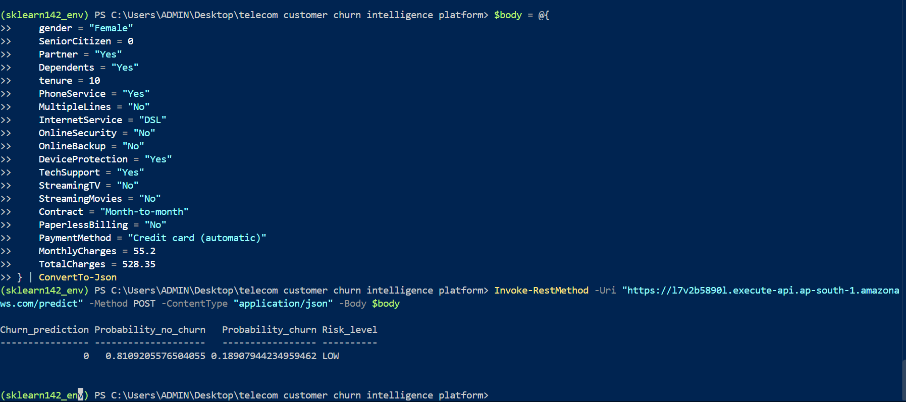

# Telecom Customer Churn Intelligence Platform

An end-to-end machine learning platform for predicting customer churn using customer demographics, service information, contract details, payment methods, tenure, and billing information.

The project combines exploratory data analysis, data preprocessing, feature engineering, categorical encoding, machine learning, hyperparameter tuning, model interpretation, Flask web development, REST API integration, and AWS cloud services to create a complete customer churn prediction workflow.

The project began as a notebook-based machine learning workflow and was extended into a real-time prediction application using Flask and AWS services.

---

## Key Features

- End-to-end customer churn machine learning pipeline
- Exploratory data analysis and data cleaning
- Feature engineering from telecom customer information
- Binary and one-hot categorical encoding
- Logistic Regression and Random Forest models
- Random Forest hyperparameter tuning using GridSearchCV
- Model feature importance analysis
- 19-feature customer input to 49-model-feature transformation
- Flask web application
- REST API integration
- Amazon SageMaker real-time model deployment
- AWS Lambda prediction orchestration
- Amazon API Gateway integration
- Amazon SNS email alerting
- LOW, MEDIUM, and HIGH churn risk classification
- Customer selection and prediction interface

---

## System Architecture

The platform connects the Flask web application to a deployed Random Forest model through Amazon API Gateway, AWS Lambda, and Amazon SageMaker.

The architecture also includes an automated risk classification and notification workflow using Amazon SNS.



### Real-Time Prediction Flow

1. The user selects a customer through the Flask web application.
2. The Flask application sends the customer information as a JSON request.
3. Amazon API Gateway receives the prediction request.
4. AWS Lambda receives and processes the request.
5. Lambda invokes the Amazon SageMaker real-time endpoint.
6. SageMaker processes the customer data using the deployed tuned Random Forest model.
7. The model returns the churn prediction and probability values.
8. Lambda classifies the customer into LOW, MEDIUM, or HIGH risk.
9. If the churn probability is at least 0.70, Lambda triggers an Amazon SNS notification.
10. The prediction response is returned through API Gateway to the Flask application.
11. The Flask application displays the prediction, probabilities, and risk level.

### Model Development and Deployment Flow

```text
Raw Telecom Dataset
        |
        v
Exploratory Data Analysis
        |
        v
Data Preprocessing
        |
        v
Feature Engineering
        |
        v
Categorical Encoding
        |
        v
Model Training
        |
        v
Hyperparameter Tuning
        |
        v
Tuned Random Forest Model
        |
        v
Amazon SageMaker
        |
        v
Real-Time Inference Endpoint
```

### AWS Prediction Workflow

```text
Flask Web Application
        |
        | HTTPS / JSON
        v
Amazon API Gateway
        |
        v
AWS Lambda
        |
        | Invoke Endpoint
        v
Amazon SageMaker
        |
        v
Tuned Random Forest
        |
        v
Prediction + Probabilities
        |
        v
AWS Lambda
        |
        +----------------------+
        |                      |
        v                      v
Risk Classification       Amazon SNS
                               |
                               v
                          Email Alert
```

### Risk Classification

```text
Probability of Churn >= 0.70
        |
        v
      HIGH

0.40 <= Probability of Churn < 0.70
        |
        v
     MEDIUM

Probability of Churn < 0.40
        |
        v
       LOW
```

---

## Project Overview

Customer churn is an important business problem for telecommunications companies. Losing customers can affect recurring revenue and increase the cost of acquiring new customers.

This project develops a machine learning-based customer churn intelligence platform that uses historical telecom customer information to identify customers who are more likely to churn.

The project goes beyond model training by connecting the trained machine learning model to a Flask web application and an AWS-based prediction workflow.

The final system allows a user to select an existing customer from the dataset and request a churn prediction.

The selected customer's information is processed through the inference pipeline, transformed into the feature structure expected by the trained model, and sent to the deployed Random Forest model through AWS services.

The prediction response contains:

- Churn prediction
- Probability of churn
- Probability of no churn
- Risk level

For customers classified as high risk, the system can trigger an Amazon SNS email notification.

### Overall Workflow

```text
Customer Dataset
       |
       v
Exploratory Data Analysis
       |
       v
Data Preprocessing
       |
       v
Feature Engineering
       |
       v
Categorical Encoding
       |
       v
Model Training
       |
       v
Hyperparameter Tuning
       |
       v
Model Interpretation
       |
       v
Flask Web Application
       |
       v
Amazon API Gateway
       |
       v
AWS Lambda
       |
       v
Amazon SageMaker
       |
       v
Churn Prediction
       |
       v
Risk Classification
       |
       +----------------------+
       |                      |
       v                      v
Prediction Result        Amazon SNS
                              |
                              v
                         Email Alert
```

---

## Problem Statement

Telecommunications companies collect large amounts of customer data, including demographic information, service subscriptions, contract details, payment methods, tenure, and billing information.

A key business challenge is identifying customers who are likely to discontinue their services.

Traditional analysis can help identify general customer trends, but machine learning can be used to learn patterns from historical customer records and generate predictions for individual customers.

The objective of this project is to develop an end-to-end machine learning platform that can:

1. Analyze historical telecom customer data.
2. Identify patterns associated with customer churn.
3. Train classification models to predict churn.
4. Generate churn probabilities for individual customers.
5. Classify customers according to churn risk.
6. Serve predictions through a web application and REST API.
7. Trigger an automated notification when a customer reaches the high-risk threshold.

---

## Project Objectives

The major objectives of this project are:

1. Perform exploratory data analysis on the telecom customer dataset.
2. Identify missing values and data-quality issues.
3. Clean and preprocess the dataset.
4. Engineer additional customer-level features.
5. Convert categorical variables into machine-readable representations.
6. Train multiple machine learning classification models.
7. Compare Logistic Regression and Random Forest.
8. Tune the Random Forest model using GridSearchCV.
9. Evaluate the selected model using classification metrics.
10. Analyze model feature importance.
11. Save the trained model for deployment.
12. Develop a Flask-based customer prediction application.
13. Allow users to select existing customer records.
14. Convert customer-level inputs into the feature structure required by the model.
15. Deploy the trained model using Amazon SageMaker.
16. Integrate SageMaker with AWS Lambda.
17. Expose the prediction workflow through Amazon API Gateway.
18. Classify customers into LOW, MEDIUM, and HIGH risk levels.
19. Trigger Amazon SNS notifications for high-risk predictions.

---

## Dataset

The project uses the Telco Customer Churn dataset.

The raw dataset is stored at:

```text
data/raw/WA_Fn-UseC_-Telco-Customer-Churn.csv
```

The original dataset contains:

- 7,043 records
- 21 columns

Important columns include:

- `customerID`
- `gender`
- `SeniorCitizen`
- `Partner`
- `Dependents`
- `tenure`
- `PhoneService`
- `MultipleLines`
- `InternetService`
- `OnlineSecurity`
- `OnlineBackup`
- `DeviceProtection`
- `TechSupport`
- `StreamingTV`
- `StreamingMovies`
- `Contract`
- `PaperlessBilling`
- `PaymentMethod`
- `MonthlyCharges`
- `TotalCharges`
- `Churn`

### Initial Churn Distribution

| Churn | Percentage |
|---|---:|
| No | 73.46% |
| Yes | 26.54% |

The dataset contained no duplicate records.

---

## Exploratory Data Analysis

Exploratory data analysis was performed in:

```text
notebooks/1_eda.ipynb
```

The analysis examined:

- Dataset structure
- Column data types
- Missing values
- Duplicate records
- Numerical distributions
- Customer tenure
- Monthly charges
- Total charges
- Churn distribution
- Potential outliers
- Class imbalance

### Initial Dataset Statistics

| Feature | Mean | Median | Minimum | Maximum |
|---|---:|---:|---:|---:|
| SeniorCitizen | 0.162 | - | 0 | 1 |
| Tenure | 32.37 | 29 | 0 | 72 |
| MonthlyCharges | 64.76 | 70.35 | 18.25 | 118.75 |

The analysis identified `TotalCharges` as an object-type column that required conversion before model development.

---

## Data Preprocessing

Data preprocessing was performed in:

```text
notebooks/2_preprocessing.ipynb
```

The preprocessing workflow included:

1. Identifying missing values.
2. Removing the 11 records with missing `TotalCharges`.
3. Converting `TotalCharges` from object to numeric format.
4. Removing the customer identifier from the model dataset.
5. Verifying that no missing values remained.

After preprocessing:

```text
Records: 7,032
Columns: 20
```

The cleaned dataset is stored at:

```text
data/processed/cleaned_telco_churn.csv
```

---

## Feature Engineering

Feature engineering was performed in:

```text
notebooks/3_feature_engineering.ipynb
```

Four additional features were created:

- `TotalServices`
- `TenureGroup`
- `MonthlyChargeCategory`
- `LongTermCustomer`

### TotalServices

`TotalServices` counts the customer's active services using the following service-related columns:

- `PhoneService`
- `MultipleLines`
- `InternetService`
- `OnlineSecurity`
- `OnlineBackup`
- `DeviceProtection`
- `TechSupport`
- `StreamingTV`
- `StreamingMovies`

The service values are converted into numerical indicators before calculating the total.

### TenureGroup

Customers are grouped according to their tenure:

| Tenure | Group |
|---|---|
| 0-12 | `0-12` |
| 13-24 | `13-24` |
| 25-48 | `25-48` |
| 49-72 | `49-72` |

### MonthlyChargeCategory

Monthly charges are grouped into:

| Monthly Charges | Category |
|---|---|
| 0-35 | Low |
| 35-70 | Medium |
| 70-120 | High |

### LongTermCustomer

Customers with a tenure of at least 24 months are classified as long-term customers.

```text
tenure >= 24  -> 1
tenure < 24   -> 0
```

---

## Categorical Encoding

Categorical encoding was performed in:

```text
notebooks/4_encoding.ipynb
```

The target variable was converted into binary form:

```text
No  -> 0
Yes -> 1
```

### Binary Encoding

The following columns were mapped into numerical values:

- `gender`
- `Partner`
- `Dependents`
- `PhoneService`
- `PaperlessBilling`

The mappings included:

```text
Male   -> 1
Female -> 0

Yes -> 1
No  -> 0
```

### One-Hot Encoding

The following categorical variables were converted using one-hot encoding:

- `MultipleLines`
- `InternetService`
- `OnlineSecurity`
- `OnlineBackup`
- `DeviceProtection`
- `TechSupport`
- `StreamingTV`
- `StreamingMovies`
- `Contract`
- `PaymentMethod`
- `TenureGroup`
- `MonthlyChargeCategory`

The encoded dataset is stored at:

```text
data/processed/encoded_telco_churn.csv
```

---

## Model Development

Model development was performed in:

```text
notebooks/5_model_training.ipynb
```

Two classification algorithms were evaluated:

1. Logistic Regression
2. Random Forest

### Logistic Regression

Logistic Regression was trained using feature scaling with `StandardScaler`.

The recorded accuracy was approximately:

```text
79.01%
```

The classification results showed stronger performance for the non-churn class than for the churn class.

### Random Forest

An initial Random Forest model was also trained.

The recorded initial accuracy was approximately:

```text
78.44%
```

The Random Forest model was then further optimized using hyperparameter tuning.

---

## Hyperparameter Tuning

Hyperparameter tuning was performed in:

```text
notebooks/6_hyperparameter_tuning.ipynb
```

`GridSearchCV` was used with:

```text
cv = 5
scoring = accuracy
n_jobs = -1
```

The parameter grid included:

```text
n_estimators:
100
200
300

max_depth:
None
10
20

min_samples_split:
2
5
10

min_samples_leaf:
1
2
4
```

### Best Parameters

The best Random Forest configuration was:

```text
n_estimators = 300
max_depth = 10
min_samples_split = 5
min_samples_leaf = 2
```

The best cross-validation accuracy was approximately:

```text
80.43%
```

The tuned model achieved a test accuracy of approximately:

```text
79.35%
```

### Tuned Model Evaluation

The tuned model produced:

```text
Accuracy: 79.35%
```

Confusion matrix:

```text
[[1162, 129],
 [ 234, 233]]
```

Classification results:

| Class | Precision | Recall | F1-Score |
|---|---:|---:|---:|
| No Churn | 0.83 | 0.90 | 0.86 |
| Churn | 0.64 | 0.50 | 0.56 |

The tuned Random Forest model was saved as:

```text
models/tuned_random_forest.pkl
```

---

## Model Interpretation

Model interpretation was performed in:

```text
notebooks/7_model_interpretation.ipynb
```

Random Forest feature importance was analyzed to identify the features that contributed most strongly to the model.

The most influential features included:

1. `tenure`
2. `TotalCharges`
3. `MonthlyCharges`
4. `Contract_Month-to-month`
5. `OnlineSecurity_No`
6. `TechSupport_No`
7. `TenureGroup_0-12`
8. `InternetService_Fiber optic`
9. `PaymentMethod_Electronic check`
10. `LongTermCustomer`

The analysis indicates that customer tenure and billing-related variables are among the important features used by the model.

---

## Real-Time Inference

The inference workflow allows the deployed model to receive customer-level information in JSON format.

The application works with 19 customer-level input fields.

The inference pipeline then:

1. Receives the JSON request.
2. Converts it into a Pandas DataFrame.
3. Creates engineered features.
4. Converts binary values into numerical form.
5. Applies one-hot encoding.
6. Adds missing model features with a value of `0`.
7. Reorders the columns according to the trained model's expected feature order.
8. Sends the resulting 49-feature DataFrame to the Random Forest model.
9. Generates the prediction and class probabilities.

The deployed model expects:

```text
49 features
```

The prediction response contains:

```json
{
  "Churn_prediction": 1,
  "Probability_no_churn": 0.20,
  "Probability_churn": 0.80
}
```

The probability values depend on the customer being evaluated.

---

## 19-to-49 Feature Transformation

The deployed Random Forest model was trained using 49 encoded features, while the application works with 19 customer-level input fields.

Therefore, an inference transformation layer is required.

```text
19 Customer Inputs
        |
        v
Feature Engineering
        |
        v
Binary Encoding
        |
        v
One-Hot Encoding
        |
        v
Missing Feature Creation
        |
        v
Feature Ordering
        |
        v
49 Model Features
        |
        v
Random Forest Model
```

The inference preprocessing layer creates:

- `TotalServices`
- `LongTermCustomer`
- `TenureGroup`
- `MonthlyChargeCategory`

It then performs the required categorical encoding and aligns the resulting columns with:

```python
model.feature_names_in_
```

This ensures that the feature order supplied during inference matches the feature order expected by the trained model.

---

## Web Application

The web application was developed using Flask.

The main application is located at:

```text
app/app.py
```

The application provides a customer-focused interface where users can:

1. Open the application.
2. Select a customer.
3. View customer information.
4. Request a churn prediction.
5. View the prediction result.
6. View churn and no-churn probabilities.
7. View the customer's risk level.

The Flask application communicates with the deployed AWS prediction workflow through the API Gateway endpoint.

### Web Interface

The application uses a custom interface designed around customer retention and churn analysis.

The interface includes:

- Customer selection
- Customer information
- Prediction results
- Churn probability
- No-churn probability
- Risk classification
- High-risk indication

---

## AWS Cloud Architecture

The cloud prediction workflow uses the following AWS services:

- Amazon SageMaker
- AWS Lambda
- Amazon API Gateway
- Amazon SNS
- AWS IAM

The model is trained locally and deployed to Amazon SageMaker for real-time inference.

The AWS prediction workflow is:

```text
Flask Web Application
        |
        v
Amazon API Gateway
        |
        v
AWS Lambda
        |
        v
Amazon SageMaker Endpoint
        |
        v
Tuned Random Forest
        |
        v
Prediction
        |
        v
Risk Classification
        |
        +------------------+
        |                  |
        v                  v
API Response         Amazon SNS
                           |
                           v
                      Email Alert
```

---

## Amazon SageMaker

Amazon SageMaker is used to host the trained Random Forest model and provide a real-time inference endpoint.

The deployment package contains:

```text
tuned_random_forest.pkl
inference.py
```

The inference script is responsible for:

- Loading the trained model.
- Receiving JSON input.
- Converting customer information into model features.
- Performing the 19-to-49 feature transformation.
- Generating predictions.
- Returning prediction probabilities.

The deployed model uses a Scikit-learn inference container.

---

## AWS Lambda

AWS Lambda acts as the serverless processing layer between API Gateway and SageMaker.

The Lambda function:

1. Receives the customer request.
2. Extracts the JSON body.
3. Sends the customer data to the SageMaker endpoint.
4. Receives the prediction response.
5. Calculates the risk level.
6. Publishes an SNS notification when the customer is high risk.
7. Returns the prediction response to the API caller.

### Risk Classification

The project uses the following risk levels:

```text
Probability of Churn >= 0.70
        |
        v
      HIGH

0.40 <= Probability of Churn < 0.70
        |
        v
     MEDIUM

Probability of Churn < 0.40
        |
        v
       LOW
```

The configured high-risk threshold is:

```text
0.70
```

---

## Amazon API Gateway

Amazon API Gateway provides the REST interface used to access the prediction workflow.

The prediction route is:

```text
POST /predict
```

The request is passed to AWS Lambda, which communicates with the SageMaker endpoint.

The overall request flow is:

```text
Client
  |
  v
API Gateway
  |
  v
Lambda
  |
  v
SageMaker
  |
  v
Prediction
  |
  v
Lambda
  |
  v
API Gateway
  |
  v
Client
```

---

## Amazon SNS Alerting

Amazon Simple Notification Service is used to send email notifications for high-risk churn predictions.

When:

```text
Probability_churn >= 0.70
```

the Lambda function publishes an alert to the configured SNS topic.

The notification contains information such as:

- Churn prediction
- Churn probability
- No-churn probability
- Risk level

This provides an automated alerting mechanism that can support customer retention workflows.

---

## Prediction Example

A high-risk customer used during testing had the following characteristics:

```json
{
  "gender": "Male",
  "SeniorCitizen": 1,
  "Partner": "No",
  "Dependents": "No",
  "tenure": 1,
  "PhoneService": "Yes",
  "MultipleLines": "Yes",
  "InternetService": "Fiber optic",
  "OnlineSecurity": "No",
  "OnlineBackup": "No",
  "DeviceProtection": "No",
  "TechSupport": "No",
  "StreamingTV": "Yes",
  "StreamingMovies": "Yes",
  "Contract": "Month-to-month",
  "PaperlessBilling": "Yes",
  "PaymentMethod": "Electronic check",
  "MonthlyCharges": 93.55,
  "TotalCharges": 93.55
}
```

The prediction for this customer was:

```text
Churn Prediction: 1
Probability of Churn: 93.22%
Risk Level: HIGH
```

Because the churn probability was above the configured high-risk threshold, an Amazon SNS email notification was triggered.

---

## Testing

Testing was performed at multiple stages of the project.

### Model Testing

The trained models were evaluated using:

- Accuracy
- Precision
- Recall
- F1-score
- Confusion matrix

The tuned Random Forest model achieved approximately:

```text
Test Accuracy: 79.35%
```

### Flask Testing

The Flask application was tested for:

- Application startup
- Customer retrieval
- Customer selection
- Prediction requests
- API response handling
- Error handling

### AWS Testing

The AWS workflow was tested across:

```text
API Gateway
      |
      v
Lambda
      |
      v
SageMaker
      |
      v
Prediction Response
```

High-risk prediction testing also confirmed that the SNS alerting workflow could send an email notification.

---

## Screenshots

The following screenshots demonstrate the application and AWS workflow.


### Prediction Result




### Amazon SageMaker


### AWS Lambda



### Amazon API Gateway



### Amazon SNS Alert


---

## Project Structure

```text
telecom-customer-churn-intelligence-platform/
|
├── app/
│   ├── app.py
│   └── templates/
│       ├── index.html
│       └── index_backup.html
|
├── data/
│   ├── raw/
│   │   └── WA_Fn-UseC_-Telco-Customer-Churn.csv
│   |
│   └── processed/
│       ├── cleaned_telco_churn.csv
│       ├── encoded_telco_churn.csv
│       └── feature_engineered_telco_churn.csv
|
├── models/
│   └── tuned_random_forest.pkl
|
├── notebooks/
│   ├── 1_eda.ipynb
│   ├── 2_preprocessing.ipynb
│   ├── 3_feature_engineering.ipynb
│   ├── 4_encoding.ipynb
│   ├── 5_model_training.ipynb
│   ├── 6_hyperparameter_tuning.ipynb
│   ├── 7_model_interpretation.ipynb
│   └── 8_flask_api.ipynb
|
├── sagemaker/
│   ├── code/
│   │   └── inference.py
│   ├── model.tar.gz
│   ├── model_package/
│   │   ├── code/
│   │   │   └── inference.py
│   │   └── tuned_random_forest.pkl
│   └── test_customer.json
|
├── screenshots/
│   ├── architecture.png
│   ├── customer-selection.png
│   ├── prediction-result.png
│   ├── feature-importance.png
│   ├── sagemaker.png
│   ├── lambda.png
│   ├── api-gateway.png
│   └── sns-alert.png
|
├── .gitignore
├── README.md
└── requirements.txt
```

---

## Installation

Clone the repository:

```bash
git clone <YOUR-GITHUB-REPOSITORY-URL>
```

Move into the project directory:

```bash
cd telecom-customer-churn-intelligence-platform
```

Create a virtual environment:

```bash
python -m venv .venv
```

Activate the environment on Windows:

```bash
.venv\Scripts\activate
```

Install the required dependencies:

```bash
pip install -r requirements.txt
```

---

## Running the Application

The Flask application is located at:

```text
app/app.py
```

From the project root, run:

```bash
python app/app.py
```

The Flask application will start on:

```text
http://127.0.0.1:5000/
```

Open the address in a web browser.

The application requires the configured AWS prediction service to be available for real-time prediction requests.

---

## API Request and Response

The prediction API accepts customer information in JSON format.

### Example Request

```json
{
  "gender": "Male",
  "SeniorCitizen": 1,
  "Partner": "No",
  "Dependents": "No",
  "tenure": 1,
  "PhoneService": "Yes",
  "MultipleLines": "Yes",
  "InternetService": "Fiber optic",
  "OnlineSecurity": "No",
  "OnlineBackup": "No",
  "DeviceProtection": "No",
  "TechSupport": "No",
  "StreamingTV": "Yes",
  "StreamingMovies": "Yes",
  "Contract": "Month-to-month",
  "PaperlessBilling": "Yes",
  "PaymentMethod": "Electronic check",
  "MonthlyCharges": 93.55,
  "TotalCharges": 93.55
}
```

### Example Response

```json
{
  "Churn_prediction": 1,
  "Probability_no_churn": 0.067806,
  "Probability_churn": 0.932194,
  "Risk_level": "HIGH"
}
```

The probability values are model-generated and depend on the customer data being evaluated.

---

## Technologies Used

### Programming Language

- Python

### Data Science

- Pandas
- NumPy
- Matplotlib
- Scikit-learn
- Joblib

### Machine Learning

- Logistic Regression
- Random Forest
- StandardScaler
- GridSearchCV
- Feature importance analysis

### Web Development

- Flask
- HTML
- CSS
- REST API

### Cloud Services

- Amazon SageMaker
- AWS Lambda
- Amazon API Gateway
- Amazon SNS
- AWS IAM

### Development Tools

- Jupyter Notebook
- VS Code
- Git
- GitHub

---

## Security and Configuration

AWS credentials and sensitive configuration values should not be stored directly in the repository.

The following information should remain private:

- AWS account identifiers
- IAM credentials
- Access keys
- Secret keys
- IAM role details
- SNS topic identifiers
- Private API configuration

AWS permissions should follow the principle of least privilege.

The Flask application and AWS Lambda function use configuration values for communication with the prediction service. These values should be managed appropriately when deploying the project to another environment.

---

## Limitations

The current implementation has several limitations:

- The model is trained using a single telecom churn dataset.
- The model performance depends on the quality and characteristics of the training data.
- The dataset contains class imbalance between churn and non-churn customers.
- The current risk thresholds are manually configured.
- The Flask application requires the prediction service to be available for real-time predictions.
- The deployed SageMaker endpoint incurs cloud costs while running.
- The current system does not automatically retrain the model when new customer data becomes available.
- The project does not currently include a production-grade monitoring and model-drift pipeline.

---

## Future Improvements

Potential improvements include:

- Automated model retraining
- Model monitoring
- Data drift detection
- Model performance monitoring
- Automated CI/CD deployment
- Containerized Flask application
- Docker-based deployment
- Authentication for the prediction API
- Improved class-imbalance handling
- Additional machine learning algorithms
- Model explainability using SHAP
- Customer retention recommendations
- Persistent prediction history
- Database integration
- Cloud-based frontend deployment
- Infrastructure as Code
- Automated testing and deployment pipelines

---

## Learning Outcomes

This project provided practical experience with the complete machine learning lifecycle.

Key learning outcomes include:

- Understanding and analyzing a real-world dataset.
- Performing exploratory data analysis.
- Handling missing values.
- Converting and cleaning data types.
- Creating meaningful engineered features.
- Encoding categorical variables.
- Training classification models.
- Comparing machine learning algorithms.
- Performing hyperparameter tuning with GridSearchCV.
- Evaluating classification models.
- Interpreting Random Forest feature importance.
- Saving trained machine learning models.
- Building a Flask web application.
- Developing REST API functionality.
- Designing an inference preprocessing pipeline.
- Aligning inference features with trained model features.
- Deploying a machine learning model using Amazon SageMaker.
- Integrating SageMaker with AWS Lambda.
- Building an API Gateway prediction workflow.
- Implementing automated SNS alerting.
- Using Git and GitHub for project version control.

---

## Conclusion

The Telecom Customer Churn Intelligence Platform demonstrates an end-to-end approach to building and deploying a machine learning application.

The project begins with raw telecom customer data and progresses through exploratory data analysis, preprocessing, feature engineering, categorical encoding, model training, hyperparameter tuning, and model interpretation.

The tuned Random Forest model is then integrated into a real-time inference workflow. A Flask web application provides a user-facing interface for selecting customers and requesting predictions.

The cloud architecture connects Amazon API Gateway, AWS Lambda, and Amazon SageMaker to provide the prediction service. Amazon SNS adds an automated alerting mechanism for high-risk churn predictions.

Overall, the project combines machine learning, web development, REST APIs, and AWS cloud services into a complete customer churn prediction platform.

---

## Author

Janaki

GitHub: Januui

This project was developed as part of my Data Science internship and focuses on building an end-to-end telecom customer churn prediction system, covering data preparation, feature engineering, machine learning, cloud-based inference, and an interactive web application for customer churn analysis.

### Skills Demonstrated

- Python
- Machine Learning
- Data Analysis
- Flask
- REST APIs
- AWS
- Amazon SageMaker
- AWS Lambda
- Amazon API Gateway
- Amazon SNS
- Git
- GitHub